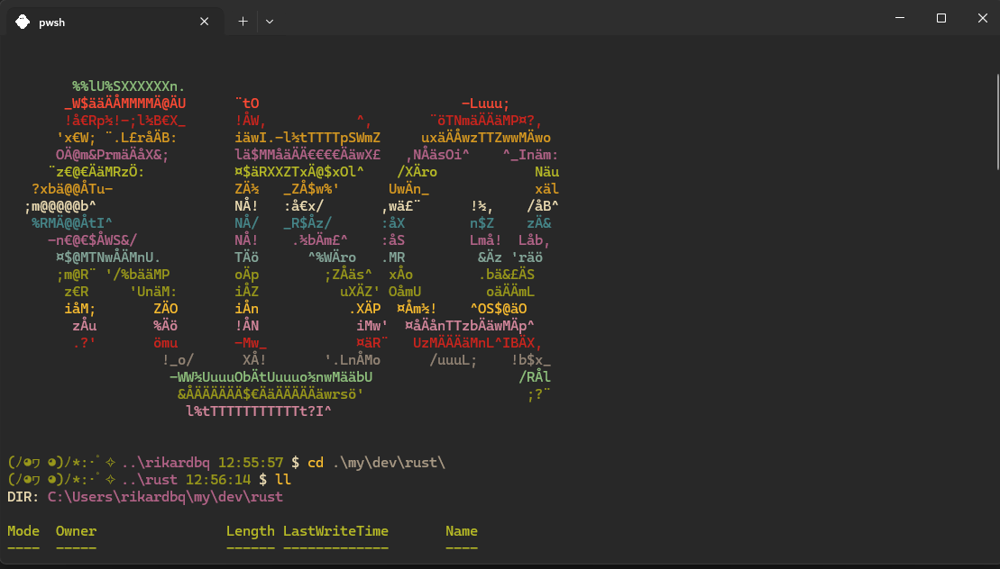

### ASCII art generator built with Rust
This was just for fun and I needed a banner in my terminal :3


### Example usage
```cargo run .\assets\picture.jpg --scale 10 --contrast 1.5```
- Will produce ```.\assets\picture_jpg.txt``` containing the text
